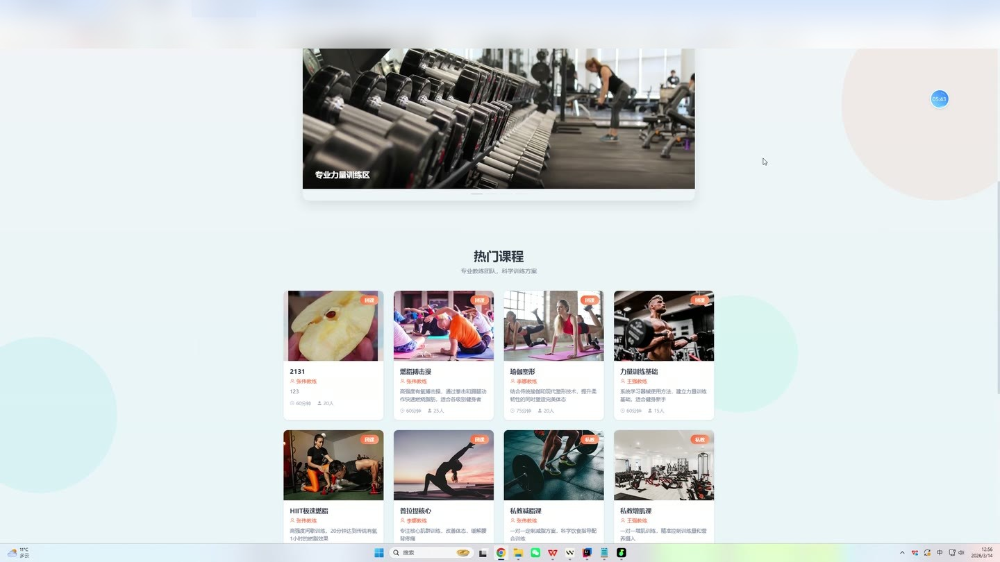
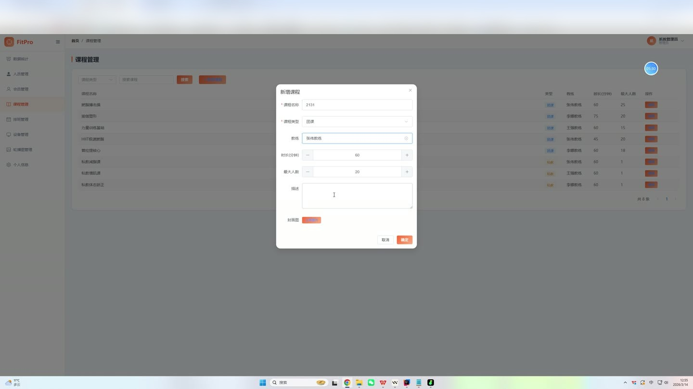
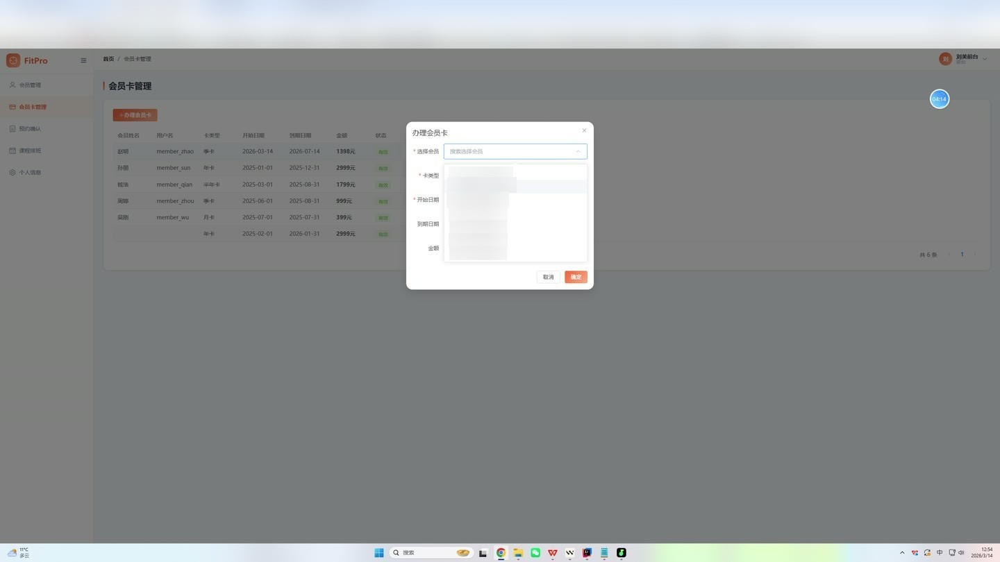
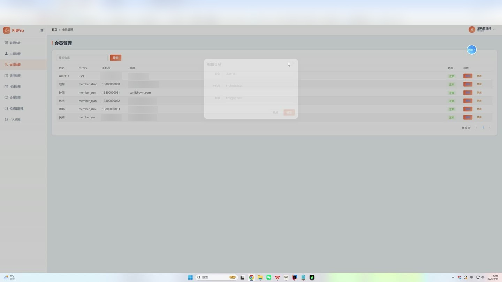

# (附文档)Springboot2+Vue3+MySQL 健身房管理系统

**技术栈**：Springboot2、Vue3、MySQL

### 系统简介

FitPro 智能健身房管理系统是一套基于 Spring Boot 2 + Vue 3 的前后端分离系统，支持管理员、前台、教练、会员四种角色协同工作。系统覆盖了会员卡管理、课程预约、教练排班、设备维护、训练计划、消费记录、数据统计等健身房核心业务场景，提供完整的后台管理界面与会员自助操作入口。
 
### 核心功能
 
### 普通用户端

 
- 查看首页轮播图（支持按状态与排序展示活跃轮播图） 
- 浏览公开课程列表（支持按课程类型、名称关键词筛选，分页展示） 
- 查看未来 7 天可预约的课程排班（按日期范围筛选，仅显示状态为 1 的排班） 
- 登录/注册（支持用户名密码登录，注册时自动赋予 MEMBER 角色，禁止注册管理员账号） 
- 查看个人信息（获取当前登录用户的基本资料、头像、角色等） 
- 修改个人信息（更新真实姓名、手机号、邮箱、性别等字段，不可修改密码与角色） 
- 修改密码（需验证原密码正确后更新为新密码） 
- 上传头像（通过文件上传接口上传图片，返回图片 URL 并更新用户头像字段）
 
### 会员端

 
- 查看自己的会员卡信息（获取当前有效的会员卡，含卡类型、起止日期、金额、状态） 
- 查看所有历史会员卡记录（按创建时间倒序排列） 
- 浏览可预约的课程排班（默认展示未来 7 天，支持自定义日期范围） 
- 预约课程（选择排班 ID 创建预约，预约成功后排班当前人数 +1，满员时排班状态自动置为 0） 
- 取消预约（仅允许取消自己未取消、未完成的预约，取消后排班人数 -1 并恢复状态为 1） 
- 查看自己的预约记录（含课程名称、教练姓名、排班日期、起止时间、状态，按创建时间倒序） 
- 查看教练给自己制定的训练计划列表（按创建时间倒序，含教练姓名、计划标题、内容、反馈） 
- 提交训练计划反馈（对指定训练计划填写反馈文字） 
- 查看自己的消费记录（按创建时间倒序，含类型、金额、描述、操作人）
 
### 教练端

 
- 查看自己的课程排班（按教练 ID 筛选，支持按开始/结束日期范围查询，默认展示未来 14 天） 
- 查看自己负责的课程列表（按教练 ID 筛选，仅显示状态为 1 的课程） 
- 查看与自己排班相关的预约记录（分页展示，含会员姓名、课程名称、预约状态、排班日期） 
- 确认预约（将预约状态从 PENDING 改为 CONFIRMED） 
- 完成预约（将预约状态改为 COMPLETED） 
- 查看自己制定的训练计划列表（按教练 ID 筛选，含会员姓名、标题、内容、反馈） 
- 创建训练计划（为指定会员制定训练计划，设置标题、内容，状态默认为 1） 
- 编辑已创建的训练计划（修改标题、内容等字段） 
- 查看会员列表（按角色 MEMBER 筛选，支持按姓名/用户名/手机号关键词搜索，分页展示）
 
### 前台端

 
- 查看会员列表（按角色 MEMBER 筛选，支持关键词搜索，分页展示） 
- 注册新会员（创建用户时自动赋予 MEMBER 角色，需检查用户名唯一性） 
- 办理会员卡（为指定会员创建会员卡，填写卡类型、起止日期、金额，同时自动生成一条消费记录，类型为 CARD，描述为“XX卡办理”） 
- 会员卡续费（延长指定会员卡的有效期，增加金额，同时自动生成一条消费记录，描述为“会员卡续费”） 
- 查看所有会员卡列表（分页展示，含会员用户名、真实姓名、卡类型、起止日期、金额、状态） 
- 查看所有预约记录（分页展示，含会员姓名、课程名称、教练姓名、排班日期、预约状态） 
- 确认预约（将预约状态从 PENDING 改为 CONFIRMED） 
- 查看可预约的课程排班（默认未来 7 天，仅显示状态为 1 的排班）
 
### 管理员端

 
- 人员管理：查看所有用户列表（支持按角色、关键词筛选，分页展示） 
- 人员管理：新增用户（创建任意角色用户，需检查用户名唯一性） 
- 人员管理：编辑用户（修改真实姓名、手机号、邮箱、角色等，不可修改密码） 
- 人员管理：删除用户（根据 ID 移除用户记录） 
- 人员管理：启用/禁用用户（切换用户 status 字段，禁用后无法登录） 
- 会员管理：查看会员列表（按角色 MEMBER 筛选，支持关键词搜索，分页展示） 
- 会员管理：延长会员卡有效期（修改指定会员卡的结束日期，并将状态置为 1） 
- 设备管理：查看设备列表（支持按设备名称/分类关键词、设备状态筛选，分页展示） 
- 设备管理：新增设备（填写名称、分类、位置、购买日期、维护周期等） 
- 设备管理：编辑设备（修改设备的所有字段） 
- 设备管理：删除设备（根据 ID 移除设备记录） 
- 设备管理：查看设备维护记录（按设备 ID 筛选，按维护日期倒序，含维护内容、费用、操作人） 
- 设备管理：添加维护记录（填写维护日期、内容、费用、操作人，同时自动更新设备的上次维护日期、下次维护日期，并将设备状态置为 NORMAL） 
- 课程管理：查看课程列表（支持按课程类型、名称关键词筛选，分页展示） 
- 课程管理：新增课程（填写课程名称、类型、教练、封面、描述、最大人数、时长等） 
- 课程管理：编辑课程（修改课程的所有字段） 
- 排班管理：查看所有课程排班（分页展示，按日期和开始时间升序，含课程名称、教练姓名） 
- 排班管理：新增排班（选择课程、教练、日期、起止时间、最大人数，初始当前人数为 0，状态为 1） 
- 排班管理：编辑排班（修改排班的所有字段） 
- 排班管理：删除排班（根据 ID 移除排班记录） 
- 轮播图管理：查看所有轮播图列表（按排序字段升序） 
- 轮播图管理：新增轮播图（填写标题、图片 URL、链接 URL、排序、状态） 
- 轮播图管理：编辑轮播图（修改轮播图的所有字段） 
- 轮播图管理：删除轮播图（根据 ID 移除轮播图记录） 
- 数据统计：查看仪表盘概览数据（包括会员总数、教练总数、总预约数、已确认预约数、设备总数、设备损坏数、设备维护中数、课程总数、有效会员卡数）
 
### 技术栈

  后端框架 Spring Boot 2.7.x   ORM MyBatis-Plus 3.5.x   权限认证 Spring Security + JWT（BCrypt 密码加密）   前端框架 Vue 3（Composition API + script setup）   状态管理 Pinia   前端路由 Vue Router 4（createWebHistory）   UI 框架 Element Plus   构建工具 Vite   数据库 MySQL 8.x 
 
### 交付内容

 
- 后端完整源码 
- 前端完整源码 
- 数据库初始化脚本 
- 万字文档

## 界面展示

---

## 获取完整源码 + 万字文档

本仓库为项目介绍页。**完整前后端源码、数据库初始化脚本、万字项目文档**，请加微信 `kangkangcode`，或访问 [codekk.top](http://codekk.top) 获取。

可作课程设计 / 毕业设计参考，支持远程部署调试。